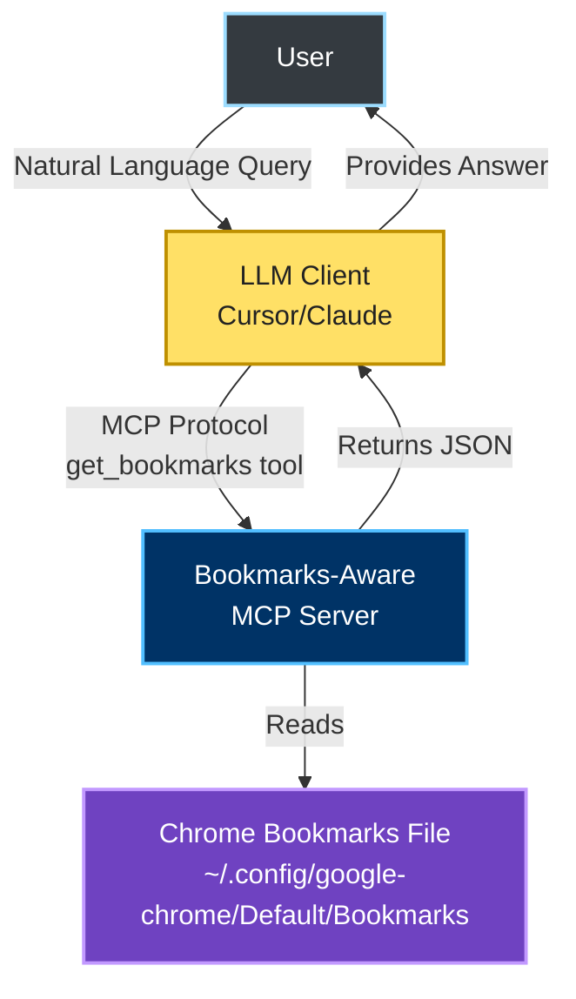
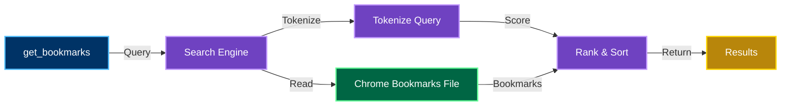

# Bookmarks-Aware MCP Server

A Model Context Protocol (MCP) server that provides read-only access to Chrome bookmarks with keyword-based search capabilities.

## Example Usage

Here's a real-world example of how the MCP server helps find and use bookmarked content:

**User Query:**
> "I don't remember how to build a durable execution engine with SQLite. But I do remember to read it in the web and bookmark the blog post. Find it to me and use to explain how to do it."

**What happens:**
1. The LLM (Cursor) recognizes the need to search bookmarks
2. It calls the `get_bookmarks` tool with the query: "durable execution engine SQLite"
3. The MCP server returns the relevant bookmark:
   ```json
   {
     "url": "https://www.morling.dev/blog/building-durable-execution-engine-with-sqlite/",
     "title": "Building a Durable Execution Engine with SQLite",
     "description": "https://www.morling.dev/blog/building-durable-execution-engine-with-sqlite/"
   }
   ```
4. The LLM uses the bookmark URL to fetch the content and provides a detailed explanation based on the bookmarked article

This demonstrates how the MCP server bridges the gap between your bookmarked knowledge and your current questions, making your bookmarks searchable and accessible through natural language queries.


## Features

- Reads Chrome bookmarks directly from the browser's data directory
- Simple keyword-based search across bookmark URLs and titles
- Extensible architecture for future semantic search enhancements
- Read-only access (no bookmark modifications)

## Installation

1. Ensure Python 3.10 or later is installed.

2. Create a virtual environment (recommended):
   ```bash
   python -m venv venv
   source venv/bin/activate  # On Windows: venv\Scripts\activate
   ```

3. Install dependencies:
   ```bash
   make setup
   ```

## Configuration

The server reads Chrome bookmarks from the default location:
- **macOS**: `~/Library/Application Support/Google/Chrome/Default/Bookmarks`
- **Windows**: `%LOCALAPPDATA%\Google\Chrome\User Data\Default\Bookmarks`
- **Linux**: `~/.config/google-chrome/Default/Bookmarks`

To use a different Chrome profile, modify the `get_chrome_bookmarks_path()` function in `src/bookmarks_reader.py` or pass a custom path.

## MCP Client Configuration (Cursor)

To use this server with Cursor, add it to your MCP configuration file (typically `~/.cursor/mcp.json`):
```json
{
  "mcpServers": {
    "bookmarks-aware-mcp": {
      "command": "python3",
      "args": ["/absolute/path/to/bookmarks-aware-mcp/src/main.py"]
    }
  }
}
```

**Important:**
- Replace `/absolute/path/to/bookmarks-aware-mcp` with the absolute path to this project directory
- Ensure you're using the correct Python interpreter (e.g., `python3` vs `python`)
- The script will automatically add the project root to Python's path, so no `cwd` is needed

### Available Tools

#### `get_bookmarks`

Search and retrieve relevant bookmarks based on a query.

**Parameters:**
- `query` (string, required): Search query to find relevant bookmarks

**Returns:**
A JSON array of bookmarks, each containing:
- `url`: The bookmark URL
- `title`: The bookmark title
- `description`: Description (currently uses URL as fallback)

**Example:**
```json
[
  {
    "url": "https://www.morling.dev/blog/building-durable-execution-engine-with-sqlite/",
    "title": "Building a Durable Execution Engine with SQLite",
    "description": "https://www.morling.dev/blog/building-durable-execution-engine-with-sqlite/"
  }
]
```

## Architecture

The server consists of three main modules:

1. **`bookmarks_reader.py`**: Reads and parses Chrome bookmarks JSON file
2. **`search.py`**: Keyword-based search engine (extensible interface for future enhancements)
3. **`server.py`**: MCP server implementation with tool definitions

### Architecture Diagrams

#### Context Viewpoint

The context diagram shows the system's external environment and interactions:



#### Functional Viewpoint

The functional diagram shows the internal components and their interactions:



#### Data Viewpoint

The data diagram shows the data structures and flow:

```mermaid
graph LR
    ChromeJSON[Chrome Bookmarks<br/>JSON Structure] -->|load_bookmarks_file| ParsedJSON[Parsed JSON<br/>Dict with roots]
    
    ParsedJSON -->|extract_bookmarks<br/>recursive traversal| BookmarkDict[Bookmark Dictionary<br/>url: string<br/>title: string<br/>description: string]
    
    BookmarkDict -->|List| BookmarksArray[List of Bookmarks<br/>List of Dict with str keys and values]
    
    BookmarksArray -->|Cache| CachedBookmarks[Global Cache<br/>_bookmarks_cache]
    
    Query[Search Query<br/>string] -->|Tokenize| QueryTokens[Query Tokens<br/>List of strings]
    
    QueryTokens -->|Score| Scoring[Scoring Process<br/>Match tokens in<br/>title + url + description]
    
    BookmarksArray -->|Input| Scoring
    Scoring -->|Ranked| ScoredResults[Scored Bookmarks<br/>List of score, bookmark tuples]
    
    ScoredResults -->|Sort & Limit| FinalResults[Final Results<br/>List of Dict with str keys and values]
    
    FinalResults -->|JSON Serialize| JSONResponse[JSON Response<br/>TextContent]
    
    %% Darker, higher contrast theme
    style ChromeJSON fill:#6f42c1,stroke:#c299ff,stroke-width:2px,color:#fff
    style ParsedJSON fill:#006644,stroke:#66ff99,stroke-width:2px,color:#fff
    style BookmarkDict fill:#003366,stroke:#52bfff,stroke-width:2px,color:#fff
    style BookmarksArray fill:#006644,stroke:#66ff99,stroke-width:2px,color:#fff
    style CachedBookmarks fill:#b8860b,stroke:#ffd700,stroke-width:2px,color:#fff
    style Query fill:#343a40,stroke:#9cdcfe,stroke-width:2px,color:#fff
    style QueryTokens fill:#6f42c1,stroke:#c299ff,stroke-width:2px,color:#fff
    style Scoring fill:#6f42c1,stroke:#c299ff,stroke-width:2px,color:#fff
    style ScoredResults fill:#006644,stroke:#66ff99,stroke-width:2px,color:#fff
    style FinalResults fill:#b8860b,stroke:#ffd700,stroke-width:2px,color:#fff
    style JSONResponse fill:#003366,stroke:#52bfff,stroke-width:2px,color:#fff
```



## Future Enhancements

For a complete list of planned features and improvements, see [TODO.md](docs/TODO.md).

## Error Handling

The server handles errors gracefully:
- Missing bookmarks file: Returns empty results with a warning message
- Malformed JSON: Logs error and returns empty results
- Invalid queries: Returns appropriate error messages

